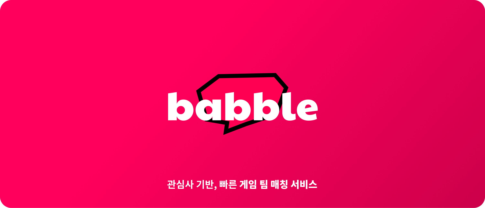
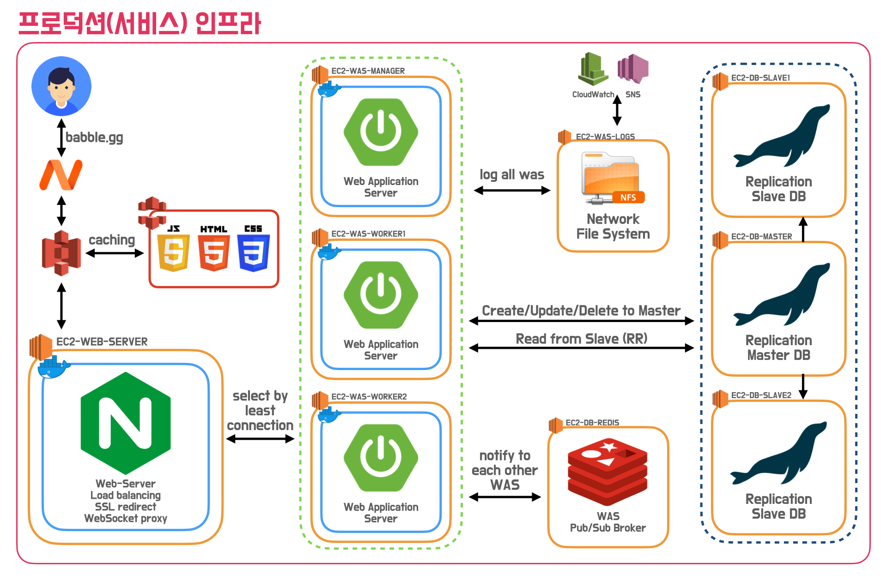
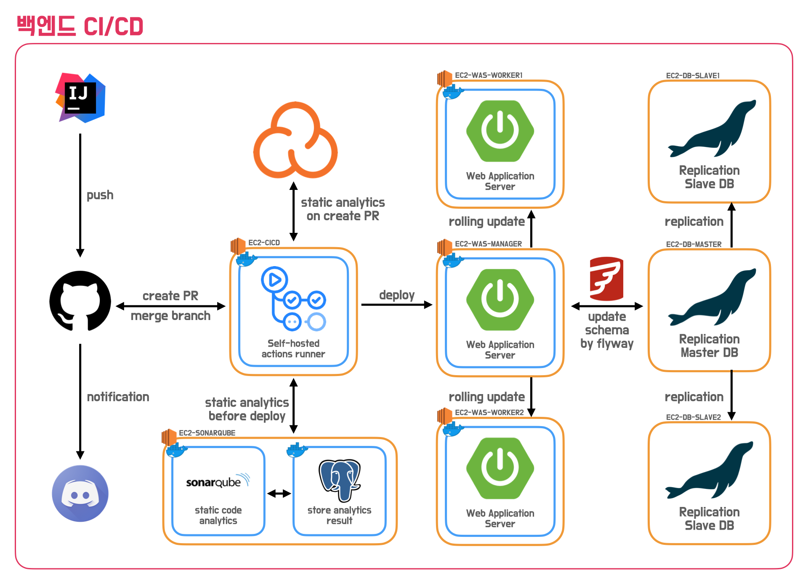
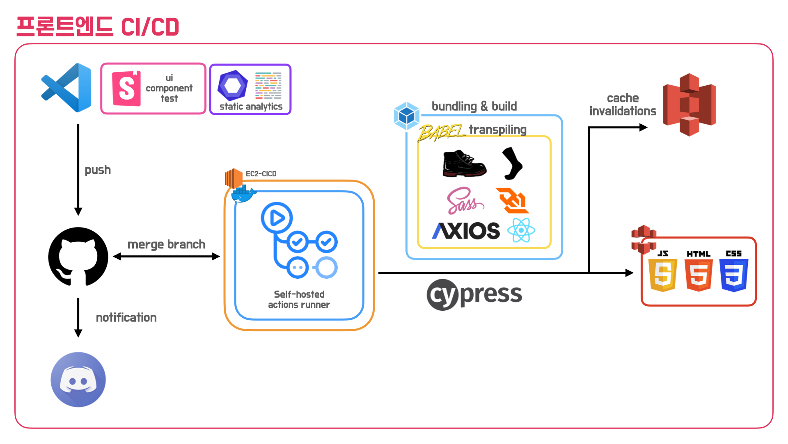
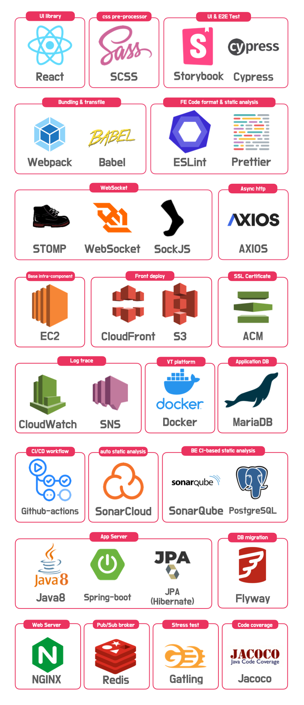

# 🌎 Babble

  

## 🚀 1. Introduction

키워드를 기반으로 한 빠른 게임 팀 매칭 서비스입니다.

> 함께 게임할 사람이 필요한 사용자들이 키워드를 통해 빠르게 팀을 찾고, 게임을 할 수 있습니다.

 
 

<h4>세부 기능을 보고싶다면?
<a href='./PREVIEW.md'>여기로!</a></h4>

 

## 💚 2. About Us

<table>
  <tr>
    <td align="center">
      <a href="https://github.com/Junroot">
        
         
        
          <b>[Back-End]</b>  
          <b>루트(김준근)</b>
        
      </a> 
      <a href="https://github.com/woowacourse-teams/2021-babble/commits?author=Junroot" title="Code">👨‍💻</a>
    </td>
    <td align="center">
      <a href="https://github.com/lns13301">
         
        
          <b>[Back-End]</b>  
          <b>와일더(강규한)</b>
        
      </a> 
      <a href="https://github.com/woowacourse-teams/2021-babble/commits?author=lns13301" title="Code">👨‍💻</a>
    </td>
    <td align="center">
      <a href="https://github.com/unluckyjung">
         
        
          <b>[Back-End]</b>  
          <b>포츈(정윤성)</b>
        
      </a> 
      <a href="https://github.com/woowacourse-teams/2021-babble/commits?author=unluckyjung" title="Code">👨‍💻</a>
    </td>
    <td align="center">
      <a href="https://github.com/Hyeon9mak">
         
        
          <b>[Back-End]</b>  
          <b>현구막(최현구)</b>
        
      </a> 
      <a href="https://github.com/woowacourse-teams/2021-babble/commits?author=Hyeon9mak" title="Code">👨‍💻</a>
    </td>
    <td align="center">
      <a href="https://github.com/ddongule">
         
        
          <b>[Front-End]</b>  
          <b>그루밍(강민경)</b>
        
      </a> 
      <a href="https://github.com/woowacourse-teams/2021-babble/commits?author=ddongule" title="Code">👩‍💻</a>
    </td>
    <td align="center">
      <a href="https://github.com/iborymagic">
         
        
          <b>[Front-End]</b>  
          <b>피터(안현철)</b>
        
      </a> 
      <a href="https://github.com/woowacourse-teams/2021-babble/commits?author=iborymagic" title="Code">👨‍💻</a>
    </td>
  </tr>
   <tr>
    <td align="center">
      <a href="https://junroot.github.io" title="Code">블로그</a>
    </td>
    <td align="center">
      <a href="https://lns13301.github.io/github-blog" title="Code">블로그</a>
    </td>
    <td align="center">
      <a href="https://unluckyjung.github.io" title="Code">블로그</a>
    </td>
    <td align="center">
      <a href="https://hyeon9mak.github.io" title="Code">블로그</a>
    </td>
    <td align="center">
      <a href="https://mingule.tistory.com" title="Code">블로그</a>
    </td>
    <td align="center">
      <a href="https://iborymagic.tistory.com" title="Code">블로그</a>
    </td>
  </tr>
</table>

<h4>babble 팀에 대해 더 알고 싶다면?
<a href='https://github.com/woowacourse-teams/2021-babble/wiki'>Babble WIKI</a></h4>

 

## 💻 3. Infra Structure

 

## 🍎 4. Tech Stacks

 

## 💊 5. Conventions

### Commit Message Format

#### [Angular JS Git Commit Message Conventions](https://docs.google.com/document/d/1QrDFcIiPjSLDn3EL15IJygNPiHORgU1_OOAqWjiDU5Y/edit)

<b>🪜 Items</b>

- `feat`: 새로운 기능
- `fix`: 버그를 수정
- `refactor`: 이미 있는 코드에 대한 리팩토링
- `css`: CSS 관련 수정
- `style`: 코드 포매팅에 관한 스타일 변경
- `docs`: Document 변경 사항
- `test`: Test Code에 대한 commit
- `build`: 빌드 관련 파일 수정 (예시 scope: gulp, broccoli, npm)
- `perf`: 성능 개선사항
- `ci`: CI 설정 파일 수정 (예시 scope: Circle, BrowserStack, SauceLabs)
- `chore`: 그 외의 작은 수정들

 

- Commit Message는 한국어를 사용
- Angular JS Git Commit Message Conventions를 따르되, Scope는 명시하지 않음

### Issue

- 해야 할 Task를 미리 Issue에 등록 후 개발

### Pull Request

- Issue에 올라온 Task를 끝내면, Pull Request를 통해 팀원들의 Review를 받은 후, develop 브랜치에 merge 함

### Branch Strategy

#### `main`

- 제품을 최종적으로 배포하는 브랜치 (develop 브랜치로부터 merge만 받는 브랜치)
- 배포에 사용됨

#### `develop`

- 아직 배포되지 않은 공용 브랜치
- feature 브랜치로부터 merge를 받는다. 개발 중에 버그를 발견하면 이 브랜치에 직접 commit함

#### `feature`

- 새로운 기능 개발을 하는 브랜치
  - 반드시 develop 로부터 시작되고, develop 브랜치에 머지함
  - **feature/기능이름**
    ex) `feature/new-feature`

#### `hotfix`

- 다음 배포 전까지 급하게 고쳐야되는 버그를 처리하는 브랜치
  - 배포 버전 심각한 버그 수정이 필요한경우, 버그 수정을 진행한뒤 main, develop 브랜치에 merge함
  - **hotfix/버그이름**
    ex) `hotfix/bugs`

 
