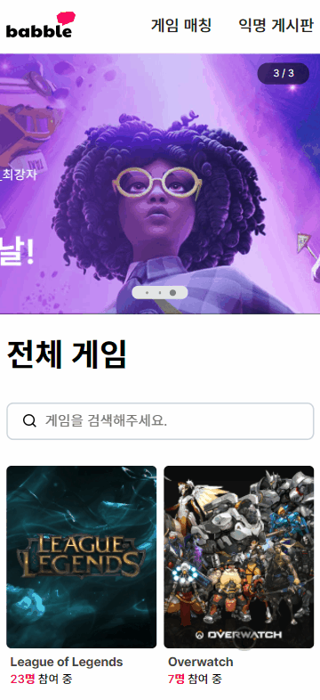
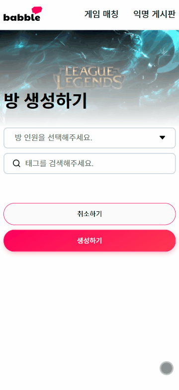
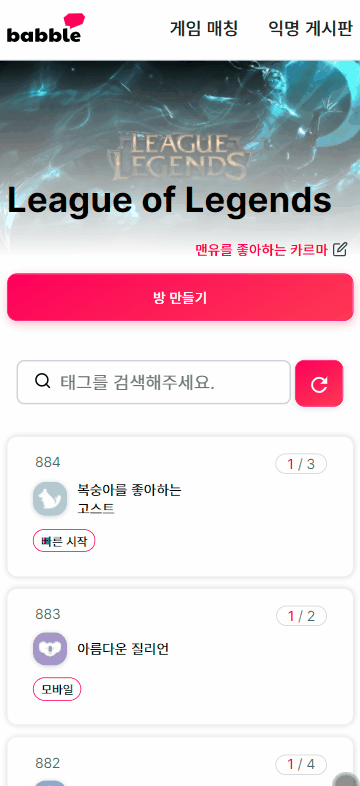
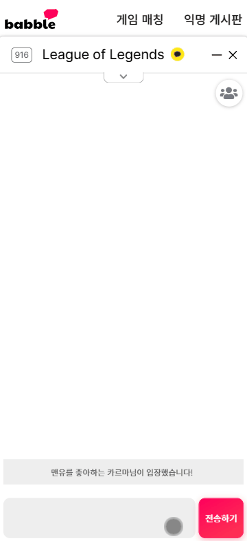
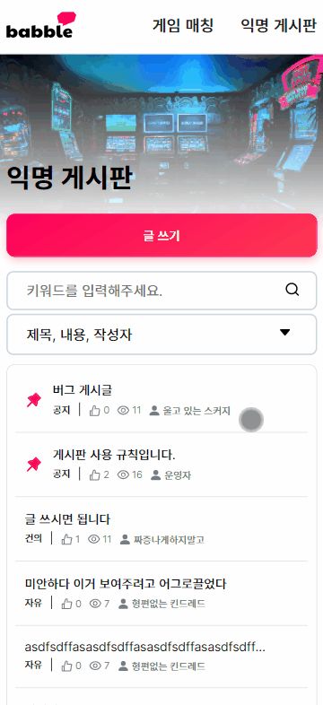
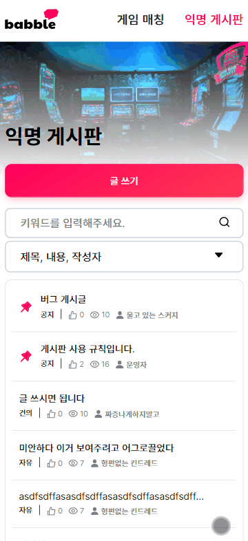
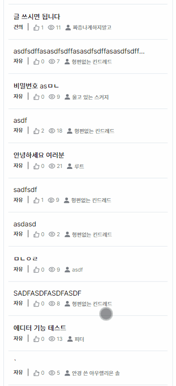
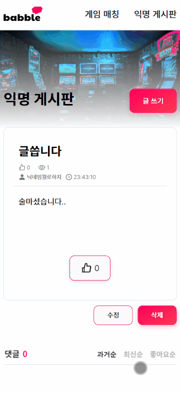
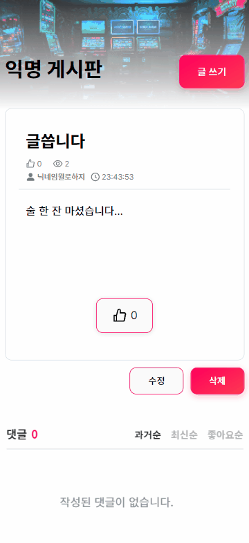

# 🌎 Babble

### [babble 기술 블로그](https://babble-dev.tistory.com/)에서도 더 많은 이야기를 만나보세요!

 

## 🚀 Introduction
키워드를 기반으로 한 빠른 게임 팀 매칭 서비스입니다.

> 함께 게임할 사람이 필요한 사용자들이 키워드를 통해 빠르게 팀을 찾고, 게임을 할 수 있습니다.

| **게임 검색** | **채팅방 검색** | **채팅방 생성** |
| :-: | :-: | :-: | 
|  |  |  | 
| **닉네임 변경** | **채팅 진행** | **게시글 검색** |
|  |  |  |
| **게시글 작성** | **게시물 조회** | **댓글 작성** |
|  |  |  |
| **게시글 수정** | **게시물 삭제** | |
|  |  | |

 

## 💻 Infra Structure & Tech Stacks

 

## 💚 About Us
|  |  |  |  |  |  |
| :----------: | :----------: | :----------: | :----------: | :----------: | :----------: |
| Back-End | Back-End | Back-End | Back-End | Front-End | Front-End |
| [루트(김준근)](https://github.com/Junroot)   [👨‍💻](https://github.com/woowacourse-teams/2021-babble/commits?author=Junroot) | [와일더(강규한)](https://github.com/lns13301)   [👨‍💻](https://github.com/woowacourse-teams/2021-babble/commits?author=lns13301) | [포츈(정윤성)](https://github.com/unluckyjung)   [👨‍💻](https://github.com/woowacourse-teams/2021-babble/commits?author=unluckyjung) | [현구막(최현구)](https://github.com/Hyeon9mak)   [👨‍💻](https://github.com/woowacourse-teams/2021-babble/commits?author=Hyeon9mak) | [그루밍(강민경)](https://github.com/ddongule)   [👩‍💻](https://github.com/woowacourse-teams/2021-babble/commits?author=ddongule) | [피터(안현철)](https://github.com/iborymagic)   [👨‍💻](https://github.com/woowacourse-teams/2021-babble/commits?author=iborymagic) |
| [루트 블로그](https://junroot.github.io) | [와일더 블로그](https://lns13301.github.io/github-blog) | [포츈 블로그](https://unluckyjung.github.io) | [현구막 블로그](https://hyeon9mak.github.io) | [그루밍 블로그](https://mingule.tistory.com) | [피터 블로그](https://iborymagic.tistory.com) |

### babble 팀에 대해 더 알고 싶다면? [Babble WIKI](https://github.com/woowacourse-teams/2021-babble/wiki)
